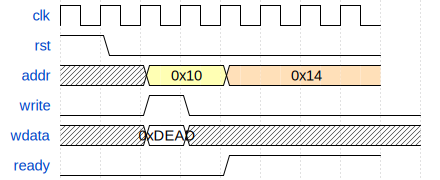

#+title: ob-wavedrom

~ob-wavedrom~ adds Org Babel support for rendering [[https://wavedrom.com/][WaveDrom]] diagrams from source blocks.

It uses the [[https://github.com/wavedrom/cli][wavedrom-cli]] command line tool to generate =.svg= or =.png= output files.

* Requirements

- Org Babel
- =wavedrom-cli= available in your =PATH=, or configured via =ob-wavedrom-cli-path=

If =wavedrom-cli= is not on your =PATH=, set its full path explicitly:

#+begin_src emacs-lisp
(setq ob-wavedrom-cli-path "/path/to/wavedrom-cli")
#+end_src

* Usage

Use a Babel source block with language =wavedrom= and a =:file= header argument.

Supported output formats:

- =.svg=
- =.png=

Example:

#+begin_src org
,#+begin_src wavedrom :file images/bus.svg :exports both
{
  "signal": [
    { "name": "clk",   "wave": "p......." },
    { "name": "rst",   "wave": "10......" },
    { "name": "addr",  "wave": "x.3.4...", "data": ["0x10", "0x14"] },
    { "name": "write", "wave": "0.10....." },
    { "name": "wdata", "wave": "x.=x.....", "data": ["0xDEAD"] },
    { "name": "ready", "wave": "0...1..." }
  ]
}
,#+end_src
#+end_src

* Notes

- =:file= is required.
- Only =.svg= and =.png= output are supported.
- By default, Babel results are configured as =file= and exports as =results=.
